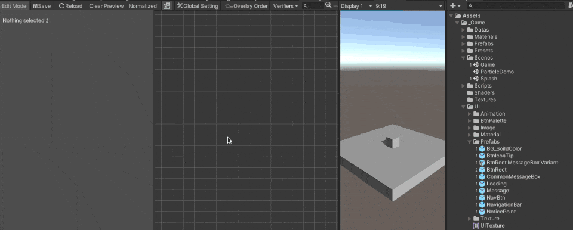
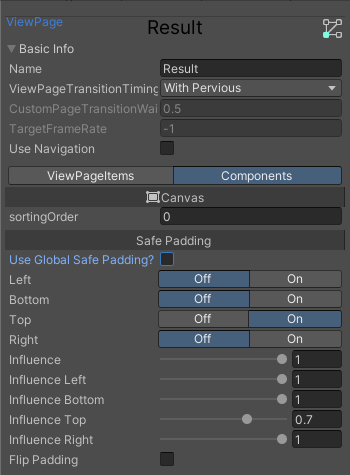

# Configuration

# Usage
Use the Visual Editor to edit your UI page.

Menu Path : MacacaGames > ViewSystem > Visual Editor
## Make a ViewPage
You can define the ViewElement and and its RectTransform info by Visual Editor.


### Position a ViewElement on ViewPage

There are 2 different ways to define the position of a ViewElement on a ViewPage: RectTransform or CustomParent.
- RectTransform

On the Visual Editor, as the gif you can define the RectTransform information of a ViewElement just like modifing the RectTransform Component.
When you're previewing a ViewPage, all modify on the RectTransform information will automatically update to the previewing Screen.

- Custom Parent

Another way to position your ViewElement is using Custom Parent mode, in Custom Parent mode the system will find the Transform object which you define and set to that Object's child.

The Custom Parent mode is despreded, we only recommend using this mode in special situation such as you would like to put a ViewElement as another ViewElement's child in the runtime.


## Override property on a ViewElement
You can override any property on ViewElement, use preview to take effect the override.
With the override system, you can simply create the ViewElement variant in different ViewPage.


### Why using ViewSystem's override but not Unity Prefab variant?
ViewSystem override is a runtime function, it means all modify only exsit during the Game is runing, use the ViewSystem override helps you to avoid to make a lot of Prefab variant assets.

Limitation, the ViewSystem override has no ability to add/remove Component, GameObject etc. In this case use Unity Prefab variant.

## Override UnityEvent on a ViewElement
The override system also support to bind UnityEvent on an UGUI selectable.

Make a method with Component parameter and attact ``ViewSystemEvent`` attribute on it, the method will show on up the override window.


Example: (In UIManager.cs)
```csharp
[MacacaGames.ViewSystem.ViewSystemEvent]
public void MyEvent(Component selectable)
{
    //Do something
}
```

## Override Property or Button.onClick on a ViewElement via script in a ViewElementBehaviour
You can override a property via Attribute in a script, take this example, this means override the `sprite` property on `UnityEngine.UI.Image` component on a child GameObject which name is `Frame` by the value of `someSprite` variable.

```csharp
// Is require a child class of ViewElementBehaviour
public class MyUILogic : ViewElementBehaviour{
    [OverrideProperty("Frame", typeof(UnityEngine.UI.Image), nameof(UnityEngine.UI.Image.sprite)) ]
    [SerializeField]
    Sprite someSprite;

    [OverrideButtonEvent("TopRect/Button")]
    void Test(Component component)
    {
        Debug.Log("success");
    }
}
```

## Override Property via script with Unity Inspector
The ViewElementOverride can let you setting the ViewElement override on any MonoBehaviour by using Unity's Inspector


See the example: 
```csharp

public class MyScript: MonoBehaviour{
    [SerializeField]
    ViewElementOverride viewElementOverride;

    void ApplyOverride()
    {
        GetComponent<ViewElement>().ApplyOverrides(viewElementOverride);
    }
}
```

By adding a ViewElementOverride Object field in your script, you will see the Override Editor in your Inspector, just use in like using the Overide Window in ViewSystem Editor.


Then use the ViewElement.ApplyOverrides() API to apply the override.
```csharp
GetComponent<ViewElement>().ApplyOverrides(viewElementOverride);
```

## Safe Area
ViewSystem support Safe Area adjustment on the screen.
Each can setup its owned Safe Area setting, or using the Safe Area global setting, the Safe Area support is modified from [5argon/NotchSolution](https://github.com/5argon/NotchSolution) and with deep intergation with ViewSystem, thanks for his/her great works!





## Page Ordering

Since the ViewSystem allow have more than one `Overlay ViewPage` in the same time, the `Overlay ViewPage` may covering eachother, therefore you need to maintain ording of the `Overlay ViewPage`s your self, to do so using the `Overlay order` tools to helps your complete the works.

