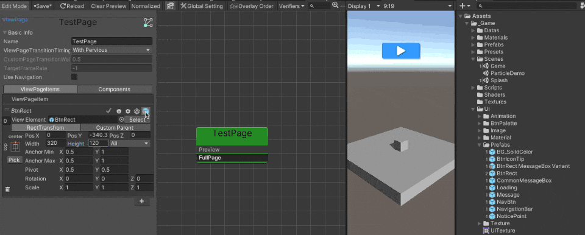
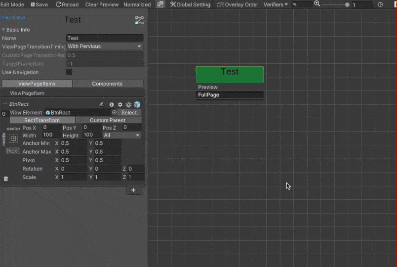
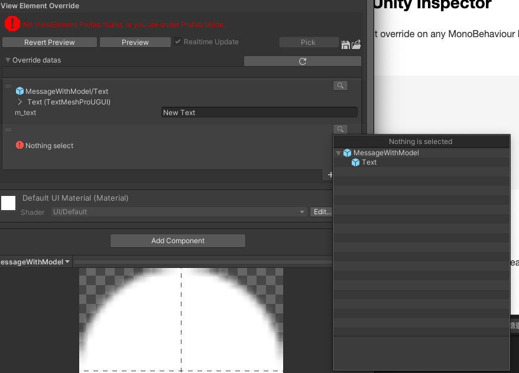
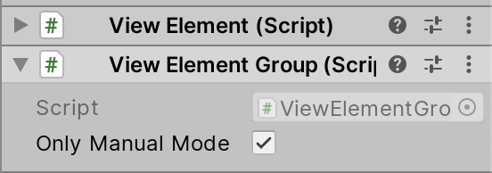

# Fundamentals 

## Page Changer

Whenever you want to show or hide a page, you need to use the `PageChanger` class. `FullPageChanger` is used for switching FullPages, while `OverlayPageChanger` is for switching OverlayPages.

`PageChanger` uses a Fluent Interface design, which allows methods to be chained together for ease of use. 

For example:
```csharp
//Display the ViewPage named TestPage
ViewController
    .FullPageChanger() // Initializes the FullPageChanger and returns a PageChanger object.
    .SetPage("TestPage") //Sets the target page and returns the same PageChanger instance.
    .Show(); //Executes the page transition.
```
<br>

> When switching FullPages, you only need to call `Show()`. The ViewSystem will automatically leave the previous FullPage and display the next one, as only one FullPage can exist at a time. In contrast, for OverlayPages, you need to manually call `Show()` and `Leave()` for each OverlayPage.

<br>

In addition to the `SetPage()` and `Show()` methods used above, there are also some advanced methods available:
- `SetPageModel(params object[] models)`: Allows passing any object to the target page. This will be discussed in more detail later (see [Lifecycle Hook and Injection](/LifeCycle%20Hook%20and%20Injection.md)).

- `SetIgnoreClickProtection(bool ignoreClickProtection)`：Determines whether to enable click protection, meaning repeated calls within the **"Minimum Interval"** (default 0.2s) will either be ignored or added to a queue. The specific behavior is controlled by `SetWaitPreviousPageFinish`. (The **Minimum Interval** can be set in the [Global Setting](/VisualEditor.md#global-setting)).

- `SetWaitPreviousPageFinish(bool wait)` ：Determines how to handle repeated calls. This option is only relevant when `Click Protection` is enabled.
If set to false, the page change will be canceled. If set to true, the page change will be added to a queue and executed after the previous page transition finishes. 


- `SetIgnoreTimeScale( bool ignoreTimeScale)`：Determines whether to ignore the timescale. If set to false, the page transition time will be affected by the timescale.

PageChanger also provides lifecycle event registration:
- `OnStart(Action OnStart)`
- `OnComplete(Action OnComplete)`
- `OnChanged(Action OnChanged)`

<!-- Show和Leave也提供CustomYieldInstruction的回傳值，你可以 await Page Transition，這對控管頁面顯示的表演非常有用：(需要UniTask QQ)
- `Show(bool customYieldInstruction)` : 
- `Leave(bool customYieldInstruction)`: -->

## FullPage LifeCycle
> Once the ChangePage API is called in the ViewController, events, callbacks, and lifecycle hooks are executed in a specific order. (The same behavior applies when using FullPageChanger.)


## Override 

### Override property on a ViewElement
You can override any property on ViewElement, use preview to take effect the override.
With the override system, you can simply create the ViewElement variant in different ViewPage.


- Runtime Flexibility:


The ViewSystem override is a runtime function, meaning that all changes exist only while the game is running. This allows you to **avoid creating multiple prefab variant assets**, saving time and reducing asset clutter.

- Limitation:

The main limitation of the ViewSystem override is that **it cannot add or remove components or GameObjects**. In cases where you need to add or remove these elements, it’s better to use Unity’s prefab variants.


### Override UnityEvent on a ViewElement
The override system also support to bind UnityEvent on an UGUI selectable.


Declare a method with a Component parameter and add the `ViewSystemEvent` attribute, and you’ll be able to find the method in the dropdown menu in the override window.




Example: (In UIManager.cs)
```csharp
[MacacaGames.ViewSystem.ViewSystemEvent]
public void MyEvent(Component selectable)
{
    //Do something
}
```


ViewSystem will search for any components in the current scene that implement the method. If found, it will create a temporary delegate. If none are found, a new object will be generated in the scene, and the component will be assigned to it.

This approach is suitable for placing a singleton object in the scene in advance, ensuring that the ViewSystem can find the component and will only find one.

### Override Property via script

- Attribute

You can override a property via `OverrideProperty` or `OverrideButtonEvent` Attribute in a script, take this example, this means override the `sprite` property on `UnityEngine.UI.Image` component on a child GameObject which name is "Frame" by the value of "someSprite" variable.

```csharp
// require a child class of ViewElementBehaviour
public class MyUILogic : ViewElementBehaviour{
    [OverrideProperty("Frame", typeof(UnityEngine.UI.Image), nameof(UnityEngine.UI.Image.sprite)) ]
    [SerializeField]
    Sprite someSprite;

    [OverrideButtonEvent("TopRect/Button")]
    void Test(Component component)
    {
        Debug.Log("success");
    }
}
```
Please note that in methods with `OverrideButtonEvent`, you cannot access other references within the same class. If you want to obtain them, you must use other methods, such as the various reference acquisition methods provided by ViewSystem (see [Get an runtime ViewElement reference in ViewPage/ViewState](#get-an-runtime-viewelement-reference-in-viewpage-viewstate)) or implement them yourself.

___

- ViewElementOverride

ViewElementOverride allows you to set the ViewElement override on any MonoBehaviour in the Inspector


See the example: 
```csharp
public class MyScript: MonoBehaviour{

    [SerializeField]
    ViewElementOverride myOverride;
}
```

By adding a `ViewElementOverride` object field in your script, you'll see the Override Editor in your Inspector. You can use it just like the Override Window in the ViewSystem Editor.




Then use `ViewElement.ApplyOverrides()` to apply the override.
```csharp
void ApplyOverride()
{
    GetComponent<ViewElement>().ApplyOverrides(myOverride);
}
```

## Get a runtime ViewElement reference in ViewPage/ViewState
If the target is an **Unique** ViewElement (with `Is Unique` set to true on the ViewElement), you get it's instance via implement IViewElementInjectable on one of its component,then using ViewController.Instance.GetInjectionInstance\<SomeInjectableClass>() API to get the instance.
```csharp
// SomeInjectableClass is attach on target ViewElement
public class SomeInjectableClass : MonoBehaviour, IViewElementInjectable
{}

SomeInjectableClass someInjectableClass = ViewController.Instance.GetInjectionInstance<SomeInjectableClass>();
```

Otherwise, use the `GetViewPageElementByName()` or `GetViewStateElementByName()` API to get the runtime instance from the target ViewPage/ViewState.

> Note: Since ViewElements are pooled and managed by the ViewSystem, these APIs **only work while the target ViewPage/ViewState is active**. The ViewElement reference may change after each `ChangePage()` call is complete.
```csharp
//Get viewElement in ViewPage
public ViewElement GetViewPageElementByName(ViewPage viewPage, string viewPageItemName);

public ViewElement GetViewPageElementByName(string viewPageName, string viewPageItemName);

public T GetViewPageElementComponentByName<T>(string viewPageName, string viewPageItemName) where T : Component;

public ViewElement GetCurrentViewPageElementByName(string viewPageItemName);

public T GetCurrentViewPageElementComponentByName<T>(string viewPageItemName) where T : Component;

//Get viewElement in ViewState
public ViewElement GetViewStateElementByName(ViewState viewState, string viewStateItemName);
        
public T GetViewStateElementComponentByName<T>(ViewState viewState, string viewStateItemName) where T : Component;

public ViewElement GetViewStateElementByName(string viewStateName, string viewStateItemName);

public T GetViewStateElementComponentByName<T>(string viewStateName, string viewStateItemName) where T : Component;

public ViewElement GetCurrentViewStateElementByName(string viewStateItemName);

public T GetCurrentViewStateElementComponentByName<T>(string viewStateItemName) where T : Component;
```

## Components

### ViewElementGroup
Sometimes we may want to use an existing ViewElement inside another ViewElement, and this is where the ViewElementGroup can help. ViewElementGroup functions similarly to a CanvasGroup. If a ViewElement has a ViewElementGroup attached, the OnShow/OnLeave intent will also be passed to its child ViewElements, ensuring the entire ViewElement shows or leaves correctly.

In the example shown in the screenshot below, the ConfirmBox is a ViewElement, with BtnNegative and BtnPositive as its child ViewElements.


The ViewElementGroup has a `Only Manual Mode` switch. When enabled, the ViewElement will ignore the OnShow/OnLeave intents sent by the ViewController. This is useful when you want to control the ViewElement's show/leave behavior through a script.


```csharp
[SerializeField]
ViewElement someViewelement;

// Set the parameter to true to show the ViewElement which ViewElementGroup's **Only Manual Mode** is on.
someViewelement.OnShow(true);

// If the ViewElement is child of other ViewElement set the first bool to false to aviod the ViewElement to be pooled while OnLeave.
someViewelement.OnLeave(false, true);
```