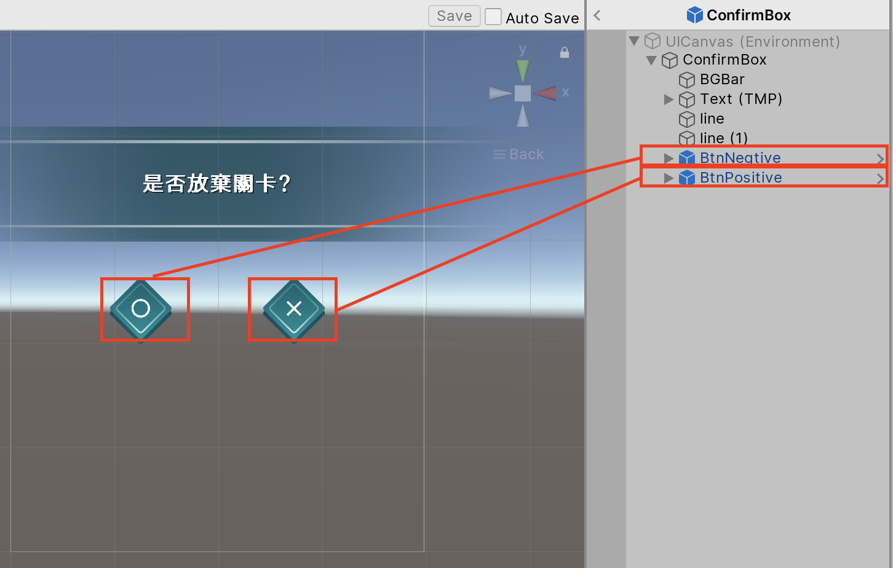
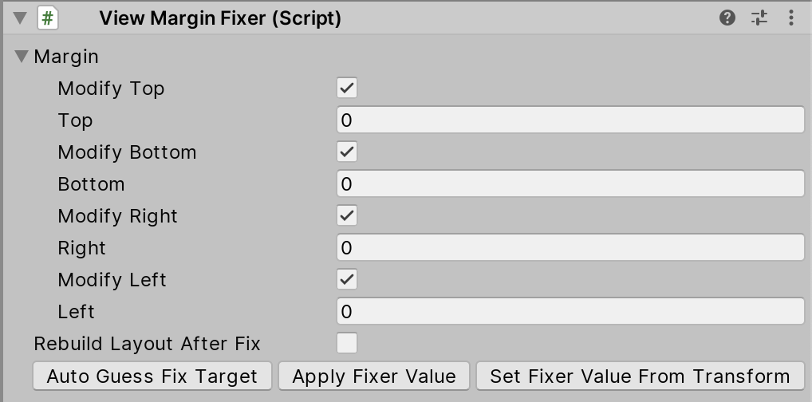
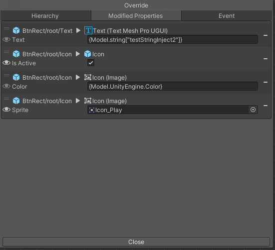
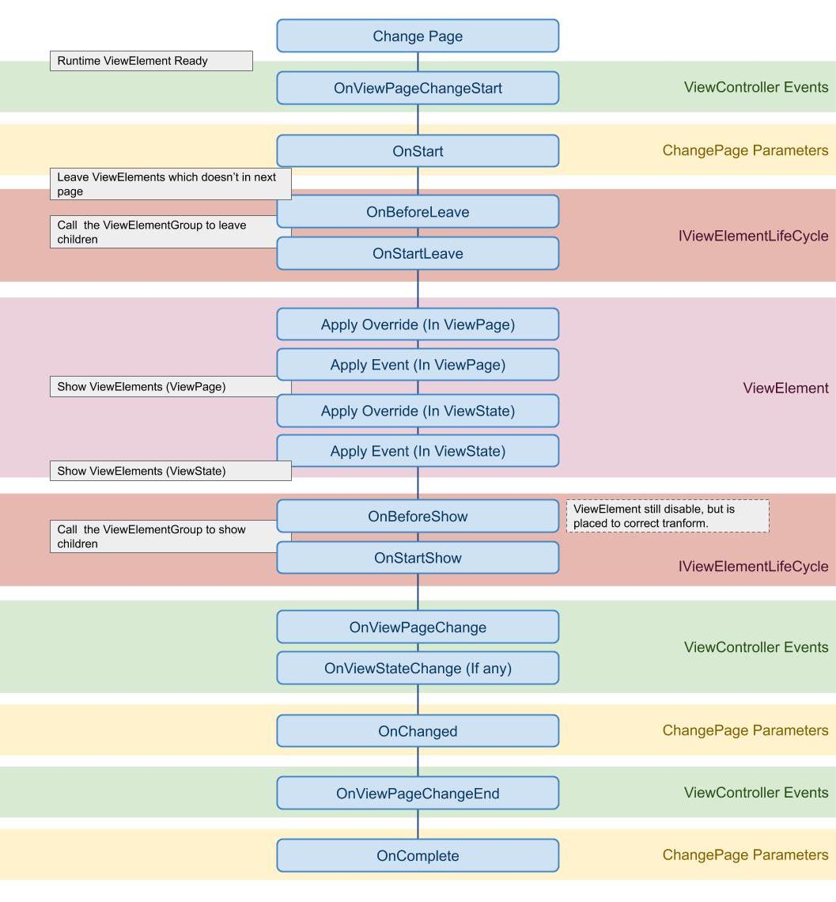

# Fundamentals 

## Override property on a ViewElement
You can override any property on ViewElement, use preview to take effect the override.
With the override system, you can simply create the ViewElement variant in different ViewPage.


### Why using ViewSystem's override but not Unity Prefab variant?
ViewSystem override is a runtime function, it means all modify only exsit during the Game is runing, use the ViewSystem override helps you to avoid to make a lot of Prefab variant assets.

The limitation is that the ViewSystem override cannot add or remove components, GameObjects, etc. In this case, use Unity Prefab variants instead.

## Override UnityEvent on a ViewElement
The override system also support to bind UnityEvent on an UGUI selectable.

Make a method with Component parameter and attact ``ViewSystemEvent`` attribute on it, the method will show on up the override window.


Example: (In UIManager.cs)
```csharp
[MacacaGames.ViewSystem.ViewSystemEvent]
public void MyEvent(Component selectable)
{
    //Do something
}
```

## Override Property or Button.onClick on a ViewElement via script in a ViewElementBehaviour
You can override a property via Attribute in a script, take this example, this means override the `sprite` property on `UnityEngine.UI.Image` component on a child GameObject which name is `Frame` by the value of `someSprite` variable.

```csharp
// Is require a child class of ViewElementBehaviour
public class MyUILogic : ViewElementBehaviour{
    [OverrideProperty("Frame", typeof(UnityEngine.UI.Image), nameof(UnityEngine.UI.Image.sprite)) ]
    [SerializeField]
    Sprite someSprite;

    [OverrideButtonEvent("TopRect/Button")]
    void Test(Component component)
    {
        Debug.Log("success");
    }
}
```

## Override Property via script with Unity Inspector
The ViewElementOverride can let you setting the ViewElement override on any MonoBehaviour by using Unity's Inspector


See the example: 
```csharp

public class MyScript: MonoBehaviour{
    [SerializeField]
    ViewElementOverride viewElementOverride;

    void ApplyOverride()
    {
        GetComponent<ViewElement>().ApplyOverrides(viewElementOverride);
    }
}
```

By adding a ViewElementOverride Object field in your script, you will see the Override Editor in your Inspector, just use in like using the Overide Window in ViewSystem Editor.


Then use the ViewElement.ApplyOverrides() API to apply the override.
```csharp
GetComponent<ViewElement>().ApplyOverrides(viewElementOverride);
```

## Safe Area
ViewSystem support Safe Area adjustment on the screen.
Each can setup its owned Safe Area setting, or using the Safe Area global setting, the Safe Area support is modified from [5argon/NotchSolution](https://github.com/5argon/NotchSolution) and with deep intergation with ViewSystem, thanks for his/her great works!


## Page Ordering

Since the ViewSystem allow have more than one `Overlay ViewPage` in the same time, the `Overlay ViewPage` may covering eachother, therefore you need to maintain ording of the `Overlay ViewPage`s your self, to do so using the `Overlay order` tools to helps your complete the works.


# Components

## ViewElementGroup
Something we me may wish to use already exsited ViewElement inside another ViewElement, in this way the ViewElementGroup can helps.
ViewElementGroup works a little like CanvasGroup, if the ViewElement has ViewElementGroup attached,the OnShow/OnLeave intent will also send into the children ViewElement, therefore the whole ViewElement will show/leave correctlly.

As the attach screenshot, the ConfirmBox is a ViewElement and BtnNegitive, BtnPositive is children ViewElement.


There is a **Only Manual Mode** switch on ViewElementGroup, if the swich on, ViewElement will ignore the OnShow/OnLeave intent send by ViewController.
It is helpful while we wish to control the ViewElement show/leave via script.
```csharp
[SerializeField]
ViewElement someViewelement;

// Set the parameter to true to manual show the ViewElement which ViewElementGroup's **Only Manual Mode** is on.
someViewelement.OnShow(true);

// If the ViewElement is child of other ViewElement set the first bool to false to aviod the ViewElement to be pooled while OnLeave.
someViewelement.OnLeave(false, true);
```


## ViewMarginFixer (Deprecated, only using in Custom Parent Mode)

> This component is Deprecated, for most of the case you should use the RectTransform mode directly.

ViewElement manage by the ViewSystem will be pooled if is not in use, that means the RectTransfrom's anchor stretch value may be wrong while it is taken out from pool. (cause by the Transfrom.SetParent(true);)

ViewMarginFixer is a helper to solve this issue, which override the anchor stretch value base on the ViewElement life cycle.




# LifeCycle Hook and Injection

## IViewElementSingleton
The component which inherit **IViewElementSingleton** interface will be created as singleton instance, we call it a ViewElementSingleton.

**ViewElementSingleton** instance is managed by the ViewController and will have only one instance during the runtime, use the **ViewController.Instance.GetInjectionInstance\<T\>()** API to the runtime instance directlly.

```csharp
public class MyViewElementSingletonSample : MonoBehaviour, IViewElementSingleton
{}

// Use GetInjectionInstance method on ViewController to get the singleton instance of ViewElement.
MyViewElementSingletonSample someInjectableClass = ViewController.Instance.GetInjectionInstance<MyViewElementSingletonSample>();
```

> Note : The ViewElement also needs to swtich the **IsUnique** boolean on to makes IViewElementSingleton works.

## IViewElementLifeCycle
We can hooks the lifecycle on ViewElement by **IViewElementLifeCycle** interface, implemented the interface to get lifecycle callback on ViewElement.
```csharp
void OnBeforeShow();
void OnBeforeLeave();
void OnStartShow();
void OnStartLeave();
void OnChangePage(bool show);
void OnChangedPage();
void RefreshView();
```

### ViewElementBehaviour

The **ViewElementBehaviour** implemented IViewElementLifeCycle and provide more useful feature.
It is useful if we wish to setup callback via inspector with UnityEvents, or inherit the component to overrid the method.

```csharp
public class SomeClass : ViewElementBehaviour
{
    public override void OnBeforeShow()
    {
       // Do something
    }
}
```

> Note : Component implemented **ViewElementBehaviour** needs to attach on ViewElement or its children.

Use the ViewController.Instance.RefreshAll(); to refresh all ViewElement on the screen.

### ViewElementInject (Model Inject)

With ViewElementBehaviour Componment, we can use a powerful feature that help us to sending the data to a Runtime ViewElement we call it **Model Inject**.

See follow example:
```csharp
// The MyUILogic.cs is attach on a ViewElement and this ViewElement is setting on the ViewPage "MyPage"
public class MyUILogic : ViewElementBehaviour
{
    [ViewElementInject]
    int testIntInject;

    [ViewElementInject]
    string testStringInject{get;set;} // also support using property
}

// Call the change page API and use SetPageModel() to set the Model data instance
ViewController.FullPageChanger()
    .SetPage("MyPage")
    .SetPageModel(23456, "my string value")
    .Show();
```
As the result, the value **23456** and **"my string value"** will automatically set into the MyUILogic.cs field(testIntInject in this case) or property(testStringInject in this case) after the ViewElement is showed!


In theory it supports all Types including custom Type
```csharp

public class MyClass{
    public int intValue;
    public bool boolValue;
}
// The MyUILogic.cs is attach on a ViewElement and this ViewElement is setting on the ViewPage "MyPage"
public class MyUILogic : ViewElementBehaviour
{
    [ViewElementInject]
    MyClass testMyClass;

    [ViewElementInject]
    List<string> testStringList{get;set;} // also support using property
}

// Call the change page API and use SetPageModel() to set the Model data instance
ViewController.FullPageChanger()
    .SetPage("MyPage")
    .SetPageModel(
        new MyClass{ intValue = 123, boolValue = false},
        new List<string>{
            "item 1",
            "item 2"
        }
    )
    .Show();
```

### Use with OverrideProperty Attribute

The model inject will complete before the ViewSystem runtime override, so you can combine the usage with the RuntimeOverride!
```csharp

public class MyUILogic : ViewElementBehaviour{
    [ViewElementInject]
    [OverrideProperty("Text", typeof(TextMeshProUGUI), nameof(TextMeshProUGUI.text))]
    string someString; // the value will set into the TextMeshProUGUI.text on the GameObject "Text"
}
```

### Inject Mutilple Model Value in with same Type
By default, the Model Inject only support each a only one value/instance in runtime.

See this example, 
```csharp
// We're going to try to set 2 string values into Model
ViewController.FullPageChanger()
    .SetPage("MyPage")
    .SetPageModel(
        "item 1",
        "item 2"
    )
    .Show();

// Will get Exception message
// "When using ViewSystem model biding, each Type only available for one instance, if you would like to bind multiple instance of a Type use Collections(List, Array) or ViewInjectDictionary<T> instead."
```
To solve this situtation, here're some advice

- Use a collection type such as **List\<T\>**
- Create a custom object type as a wrapper
- Use **ViewInjectDictionary\<T\>**

#### ViewInjectDictionary\<T\>

ViewInjectDictionary\<T\> is the predefine dictionary to solve the problems, the T is the the target Property/Field Type.

```csharp
// For instance, the ViewElementBehaviour is defined like this
public class MyViewBehaviour: ViewElementBehaviour{
    
    [ViewElementInject]
    string testStringInject1;
    [ViewElementInject]
    string testStringInject2;

}

var datas = new ViewInjectDictionary<string>();
datas.TryAdd("testStringInject1", "value1"); // The Key is the field/property name, the value is the value to set
datas.TryAdd("testStringInject2", "value2"); // The Key is the field/property name, the value is the value to set
ViewController.FullPageChanger()
    .SetPage("MyPage")
    .SetPageModel(datas)
    .Show();
```

### Page Model and Shared Model
Until now, all sample use the SetPageModel() API to set the model data, by this way we call it **Page Model**, means those model data only works during the ViewPage lifecycle.

There is another model scope which is call **Shared Model**, the Shared Model is manage by the ViewSystem, by default all **IViewElementSingleton** will become Shared Moedl automatically, which means you can use  [ViewElementInject] to inject them in a ViewElementBehaviour.

See the example:
```csharp
// Define a IViewElementSingleton sample
public class MyViewElementSingletonSample : MonoBehaviour, IViewElementSingleton{}

// The MyUILogic.cs is attach on a ViewElement and this ViewElement is setting on the ViewPage "MyPage"
public class MyUILogic : ViewElementBehaviour
{
    [ViewElementInject]
    MyViewElementSingletonSample myViewElementSingletonSample; // Since MyViewElementSingletonSample is a IViewElementSingleton, we don't need to use SetPageModel(), the system still can complete the value inject;
}
```

Or you can Set the Shared Model to the System use the API, ViewController.Instance.SetSharedMoedl();
See the example:
```csharp

public class MyClass{
    public int intValue;
    public bool boolValue;
}

// The MyUILogic.cs is attach on a ViewElement and this ViewElement is setting on the ViewPage "MyPage"
public class MyUILogic : ViewElementBehaviour
{
    [ViewElementInject]
    MyClass myClass;
}

// Call the ViewController.Instance.SetSharedMoedl(); somewhere before the ChangePage API is called.
/// Set the model data to the System, it will become a Shared Model
/// Each type can only have one value/instance, the system will automatically override the new value if duplicate type is trying to Set
ViewController.Instance.SetSharedMoedl(new MyClass{intValue = 123, boolValue = false});

// Call the change page API this time don't use SetPageModel()
ViewController.FullPageChanger()
    .SetPage("MyPage")
    .Show();
```

As the result, though we don't use SetPageModel() API, the value still injected! Due to the system will automatically fallback to search the **Shared Model**

#### Model Search Scope
There are 4 ways to control the model searching scope, we can use the enum **InjectScope** to control.

The default scope is PageFirst

    InjectScope.PageFirst : Search the value from the PageModel first and then SharedModel
    InjectScope.PageOnly : Search the value from the PageModel only.
    InjectScope.SharedFirst : Search the value from the SharedModel first, and then PageModel, 
    InjectScope.SharedOnly : Search the value from the SharedModel only.

```csharp
// The MyUILogic.cs is attach on a ViewElement and this ViewElement is setting on the ViewPage "MyPage"
public class MyUILogic : ViewElementBehaviour
{
    [ViewElementInject(InjectScope.PageOnly)] // change the search scope
    MyClass myClass;
}
```

### Use Model Inject with OverrideWindow
The ViewSystem Editor provide a very convient way to let developer setting the override value. 

See [Override property on a ViewElement](#override-property-on-a-viewelement) to learn how to use it.

By default, the Override Window let you set the **Edit Time** value, but we can use some special syntax to use the **Model Inject** value.

#### Syntax
```
{InjectScope.TypeName[key]}  
```

| Syntax           | Describ                                                                                              | Example                                 |
| ---------------- | ---------------------------------------------------------------------------------------------------- | --------------------------------------- |
| ModelInjectScope | The model inject scope, use the InjectScope enum value in 'String' or just use 'Model'               | Model <br>PageFirst <br> Page Only <br> |
| TypeName         | The full type name of the object you would like to use, the system will not check the type mismatch. | int, string, UnityEngine.Color          |
| key              | If using the ViewInjectDictionary, set the key here.                                                 |                                         |


See the Example:
```csharp
var datas = new ViewInjectDictionary<string>();
datas.TryAdd("testStringInject1", "value1"); // The Key is the field/property name, the value is the value to set
datas.TryAdd("testStringInject2", "value2"); // The Key is the field/property name, the value is the value to set
ViewController.FullPageChanger()
    .SetPage("MyPage")
    .SetPageModel(
        datas,
        34234,
        Color.red
    )
    .Show();

// Set the syntax likes below to use the Model value in runtime
// {Model.string["testStringInject1"]}  --> this apply the value "value1" in runtime  
// {Model.int}  --> this apply the value 34234 in runtime  
// {Model.UnityEngine.Color}  --> this apply the value Color.red in runtime

// Also work, more solid
// {PageFirst.string["testStringInject1"]} --> Same as {Model.string["testStringInject1"]} 
// {PageOnly.string["testStringInject1"]} --> will only search value from PageModel
```



> To Set the model inject syntax string on a non string field e.g. Color, you can click the **Eye** Icon on the left of the item to switch the editor display method

# System LifeCycle
## ViewController Initialization
> Here shows the Initialize proccess in ViewController. (Since V1 is dropped.)
1. Finding the UIRoot parent GameObject setup in GlobalSetting.
2. Instantiate UIRoot GameObject setup in GlobalSetting.
3. Generate ViewElementPool instance in scene.
3. Generate ViewElementRuntimePool instance in scene and initialize it.
4. Load ViewPage and ViewState data store in ViewSystemSaveData Object.
5. Pre-generate the ViewElement which has component inherited IViewElementInjectable

## FullPage ChangePage
> Once the ChangePage API is call in ViewController, the event, callback, lifecycle hack excude order. (Same behaviour while using FullPageChanger)



# How to...
## Get an runtime ViewElement reference in ViewPage/ViewState
If the target is an Unique ViewElement, you get it's instance via implement IViewElementInjectable on one of its component,then using ViewController.Instance.GetInjectionInstance\<SomeInjectableClass>() API to get the instance.
```csharp
// SomeInjectableClass is attach on target ViewElement
public class SomeInjectableClass : MonoBehaviour, IViewElementInjectable
{}

SomeInjectableClass someInjectableClass = ViewController.Instance.GetInjectionInstance<SomeInjectableClass>();
```

Otherwise GetViewPageElementByName or GetViewStateElementByName API to get the runtime instance in target ViewPage/ViewState.

Note:Since ViewElement is pooled and managed by ViewSystem, so those API only works while the target ViewPage/ViewState is live.
ViewElement reference may changed after each ChangePage() call is complete.
```csharp
public ViewElement GetViewPageElementByName(ViewPage viewPage, string viewPageItemName);

public ViewElement GetViewPageElementByName(string viewPageName, string viewPageItemName);

public T GetViewPageElementComponentByName<T>(string viewPageName, string viewPageItemName) where T : Component;

public ViewElement GetCurrentViewPageElementByName(string viewPageItemName);

public T GetCurrentViewPageElementComponentByName<T>(string viewPageItemName) where T : Component;

//Get viewElement in statePage
public ViewElement GetViewStateElementByName(ViewState viewState, string viewStateItemName);
        
public T GetViewStateElementComponentByName<T>(ViewState viewState, string viewStateItemName) where T : Component;

public ViewElement GetViewStateElementByName(string viewStateName, string viewStateItemName);

public T GetViewStateElementComponentByName<T>(string viewStateName, string viewStateItemName) where T : Component;

public ViewElement GetCurrentViewStateElementByName(string viewStateItemName);

public T GetCurrentViewStateElementComponentByName<T>(string viewStateItemName) where T : Component;
```