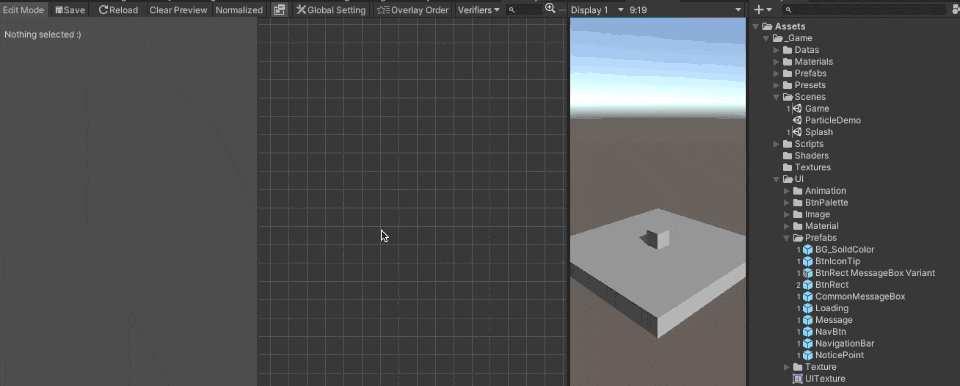

# GettingStarted

Here are the steps required to get the ViewSystem up and running:

### Create ViewController
In the Scene which you wish to add UI, create a new GameObject and attach ViewControll Component, then drag ViewSystemData to component.


### Create UGUI Canvas with Editor
Navigate to Menu Bar : MacacaGames > ViewSystem > Visual Editor

Click ``GlobalSetting`` button on toolbar.
- Click the ``Generate default UI Root Object`` button to automatically generate your first UI root. All ViewPages and ViewElements generated at runtime will be placed under this object.
- Remember click ``Save`` button on toolbar after all step is done


ViewSystem will create and save data under Assets/ViewSystemResources folder.

### Make a ViewElement
Create a UI object (`Image`, `Button`, `Dropdown`, etc.) and attach the `ViewElement` component to it.

Make it into a prefab so we can use it later.

### Make a ViewPage
Right click on empty space > Add FullPage

Add the `ViewElement` you just created to `ViewPageItems`. 



### Preview ViewPage
Turn on `Edit Mode` in the upper left corner. This will create a temporary scene, allowing users to preview changes in the ViewPage in real-time.

(Turn off or click save button before enter play mode, since Preview ViewPage only work properly under edit mode)

### Position a ViewElement on ViewPage

There are 2 different ways to define the RectTransform of a ViewElement on a ViewPage: RectTransform or CustomParent.
- RectTransform

Define RectTransform of a ViewElement just like modifing the RectTransform Component in Inspector window.
When you're previewing a ViewPage, all modify on the RectTransform information will automatically update to the previewing Screen.

- Custom Parent (deprecated)

In Custom Parent mode the system will find the Transform object which you define and set to that Object's child.

This mode is deprecated, we only recommend using this mode in special situation such as you would like to put a ViewElement as another ViewElement's child in the runtime.


### Show page

Add following script to your project, and attach it to a GameObject in the scene.

```csharp
public class GameStart : MonoBehaviour
{
    // show a viewPage on Awake
    void Awake()
    {
        //replace this with your ViewPage name 
        string yourPageName = "TestPage";
        ViewController
            .FullPageChanger()
            .SetPage(yourPageName)
            .Show();
    }
}
```
### Run and Test
Run Unity and check your first page. You can track the currently displayed page in the ViewSystem Visual Editor. 

>Make sure to open the ViewSystem Visual Editor **before** running your game, or it won’t display correctly.

<!-- TODO:補圖 -->


