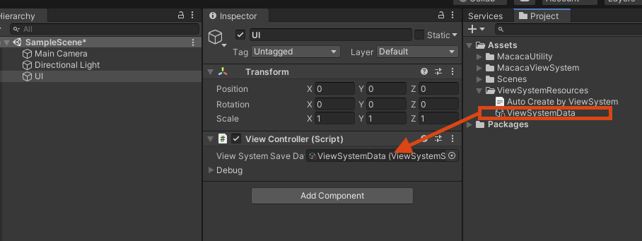
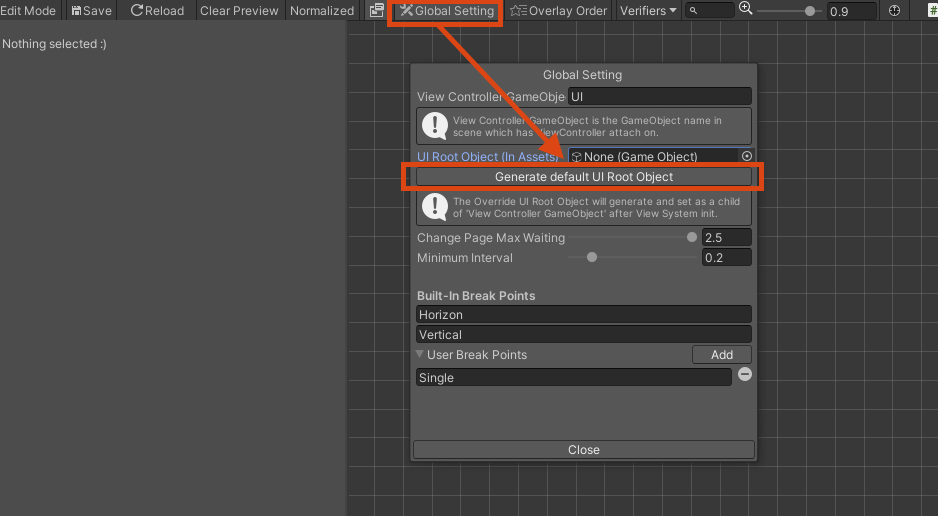
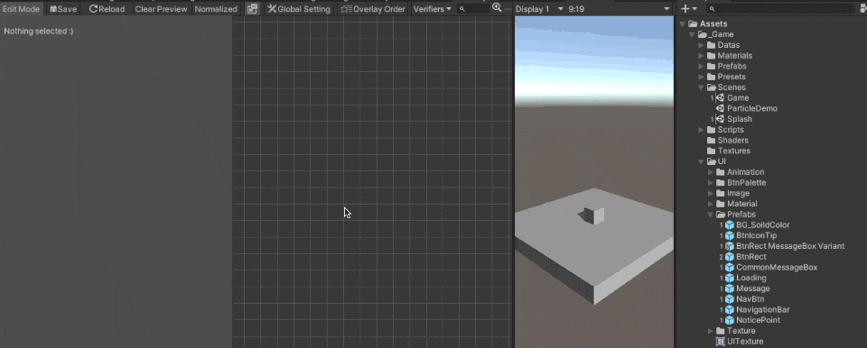

# GettingStarted

Here are the steps required to get the ViewSystem up and running:

### Create ViewController
In the Scene which you wish to add UI, create a new GameObject and attach ViewControll Component, then drag ViewSystemData to component.



### Create UGUI Canvas with Editor
Navigate to Menu Bar : MacacaGames > ViewSystem > Visual Editor

Click ``GlobalSetting`` button on toolbar.
- Click the ``Generate default UI Root Object`` button to automatically generate your first UI root. All ViewPages and ViewElements generated at runtime will be placed under this object.
- Remember click ``Save`` button on toolbar after all step is done



ViewSystem will create and save data under Assets/ViewSystemResources folder.

### Make a ViewElement
Create a UI object (`Image`, `Button`, `Dropdown`, etc.) and attach the `ViewElement` component to it.

Make it into a prefab so we can use it later.

### Make a ViewPage
Right click on empty space > Add FullPage

Add the `ViewElement` you just created to `ViewPageItems`. 



### Preview ViewPage
Turn on `Edit Mode` in the upper left corner. This will create a temporary scene, allowing users to preview changes in the ViewPage in real-time.

(Turn off or click save button before enter play mode, since Preview ViewPage only work properly under edit mode)

### Position a ViewElement on ViewPage

There are 2 different ways to define the RectTransform of a ViewElement on a ViewPage: RectTransform or CustomParent.

| Feature        | Description                                                                                                                                     |
| -------------- | ----------------------------------------------------------------------------------------------------------------------------------------------- |
| RectTransform  | Define the RectTransform of a ViewElement just like modifying the RectTransform component in the Inspector window. <br> When previewing a ViewPage, any changes to the RectTransform will automatically update on the previewing screen. |
| Custom Parent (deprecated) | In Custom Parent mode, the system finds the Transform object that you define and sets the ViewElement as a child of that object. <br> This mode is deprecated, we only recommend using this mode in special situation such as you would like to put a ViewElement as another ViewElement's child in the runtime.|


### Show page

Add following script to your project, and attach it to a GameObject in the scene.

```csharp
public class GameStart : MonoBehaviour
{
    // show a viewPage on Awake
    void Awake()
    {
        //replace this with your ViewPage name 
        string yourPageName = "TestPage";
        ViewController
            .FullPageChanger()
            .SetPage(yourPageName)
            .Show();
    }
}
```
### Run and Test
Run Unity and check your first page. You can track the currently displayed page in the ViewSystem Visual Editor. 

>Make sure to open the ViewSystem Visual Editor **before** running your game, or it won’t display correctly.

### Example project

If you want to check out the sample Unity project, you can refer to the [ViewSystem Example](https://github.com/MacacaGames/ViewSystemExample). It includes feature demonstrations and practical examples.

