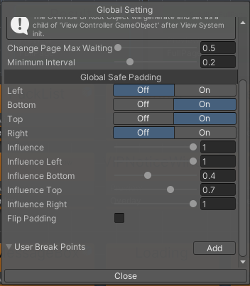
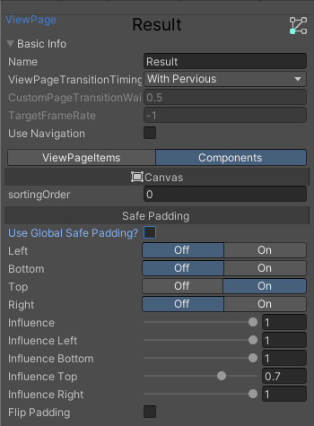
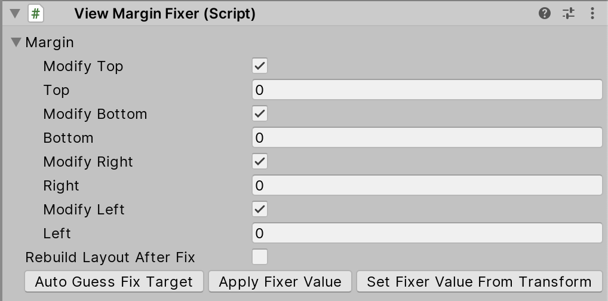
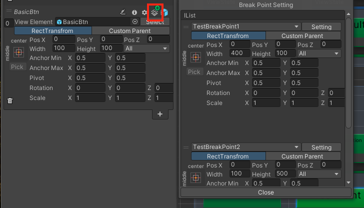

# HelpTools

### Safe Area
ViewSystem supports Safe Area adjustments on the screen. Each page can have its own Safe Area settings or use the global Safe Area configuration. This Safe Area support is adapted from [5argon/NotchSolution](https://github.com/5argon/NotchSolution) and deeply integrated into ViewSystem. Special thanks to him/her for the great work!

- Global Safe Area configuration: View System Visual Edito > tool bar > Global Setting 

- Settings for each page individually: Click any page > switch to Components tab

### ViewMarginFixer (Deprecated, only used in Custom Parent Mode)

> This component is deprecated. In most cases, you should use RectTransform mode directly.

ViewElements managed by the ViewSystem are pooled when not in use, which means the RectTransform's anchor stretch values might be incorrect when they are retrieved from the pool (due to the Transform.SetParent(true) call).

ViewMarginFixer is a helper tool that addresses this issue by overriding the anchor stretch values based on the ViewElement's lifecycle.

 
### Breakpoint

A **Breakpoint** is a feature that allows a ViewElement to adjust its transform information based on the current state. The ViewElement's transform is determined by the currently activated breakpoint.

Breakpoints are distinguished by their names, and you **cannot** have more than one breakpoint with the same name. Breakpoints are stored in a dictionary format. In the [Global Setting](/VisualEditor.md#global-setting), you can add, remove, or rename breakpoints.

Breakpoints are controlled by two APIs: `ViewController.Instance.SetBreakPoint(string breakPoint)` and `ViewController.Instance.RemoveBreakPoint(string breakPoint)`.

When you call `SetBreakPoint(string breakPoint)`, the specified breakpoint is activated. Upon entering a new page, if any ViewElement have a transform set for the active breakpoint, they will apply the specified transform.

A ViewElement can have multiple breakpoints, and it will check and apply the first activated breakpoint from top to bottom.
