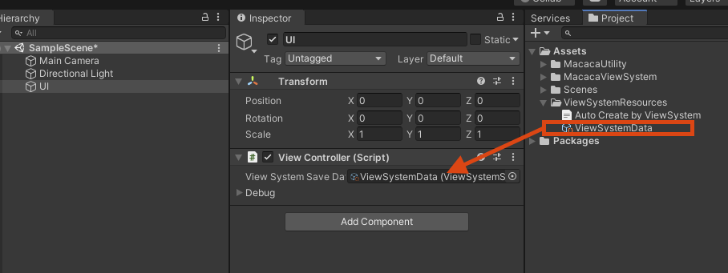
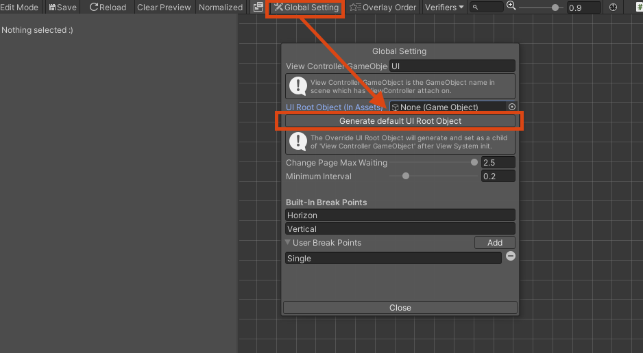

# Installation

There are several options to download View System, so feel free to choose the one that best suits your project.

## Download
### Option 1: OpenUPM (Recommend)

```sh
openupm add com.macacagames.viewsystem
```

### Option 2: Unity Package file
Add it to your editor's manifest.json file like this:
```json
{
    "dependencies": {
        "com.macacagames.utility": "https://github.com/MacacaGames/MacacaUtility.git",
        "com.macacagames.viewsystem": "https://github.com/MacacaGames/MacacaViewSystem.git"
    }
}
```

### Option 3: Git SubModule
```bash
git submodule add https://github.com/MacacaGames/MacacaViewSystem.git Assets/MacacaViewSystem
```
Note: ViewSystem depends on MacacaUtility, so make sure to also add MacacaUtility as a git submodule.
```bash
git submodule add hhttps://github.com/MacacaGames/MacacaUtility.git Assets/MacacaUtility
```

## Setup

### 1. Create ViewController
In the Scene which you wish to add UI, create a new GameObject and attach ViewControll Component, then drag ViewSystemData to component.


### 2. Create UGUI Canvas with Editor
Navigate to Menu Bar : MacacaGames > ViewSystem > Visual Editor

Click ``GlobalSetting`` button on toolbar.
- Click the ``Generate default UI Root Object`` button to automatically generate your first UI root.
- Set ViewController gameObject name to ``View Controller GameObject`` field. (As the screenshot is ``UI``)
- Remember click ``Save`` button on toolbar after all step is done



ViewSystem will create and save data under Assets/ViewSystemResources folder.

### 3. Ready to go!
Now, all setup step is done, use Example Project to learn how to edit your UI.