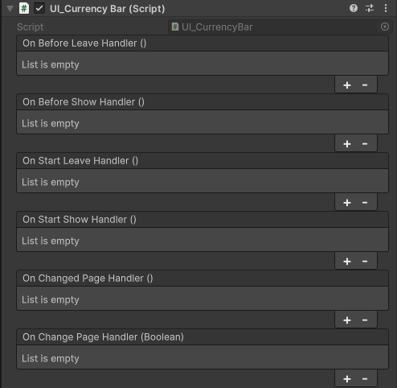
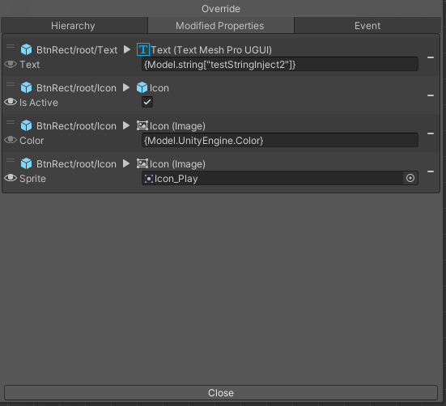

# LifeCycle Hook and Injection

### IViewElementSingleton
Components that inherit the `IViewElementSingleton` interface will be created as singleton instances, referred to as **ViewElementSingleton**.

A **ViewElementSingleton** is managed by the ViewController and will only have one instance during runtime. Use the `ViewController.Instance.GetInjectionInstance<T>()` API to directly access the runtime instance.

To create and use a ViewElementSingleton:

1. Create a ViewElement prefab.
2. Attach a script that inherits from the `IViewElementSingleton` interface to the ViewElement object.
3. Check the "isUnique" box on the ViewElement component.
4. Put it into any ViewState or ViewPage
5. call `ViewController.Instance.GetInjectionInstance<T>()` at runtime.

```csharp
//inherits IViewElementSingleton
public class MyViewElementSingleton : ViewElementBehaviour, IViewElementSingleton
{
}
```

```csharp
// Use GetInjectionInstance method to get the singleton instance of ViewElement.
MyViewElementSingleton someInjectableClass = ViewController.Instance.GetInjectionInstance<MyViewElementSingleton>();
```

### IViewElementLifeCycle
We can hooks the lifecycle on ViewElement by `IViewElementLifeCycle` interface, implemented the interface to get lifecycle callback on ViewElement.
```csharp
// These are lifecycle functions to implement:
void OnBeforeShow();
void OnBeforeLeave();
void OnStartShow();
void OnStartLeave();
void OnChangePage(bool show);
void OnChangedPage();
void RefreshView();
```

For example, if you want to determine whether a button should be displayed when entering a page:

```csharp
//Attach this script to a ViewElement, and put this ViewElement in a ViewPage
public class MyViewElementLifeCycle : Monobehavior, IViewElementLifeCycle
{
    Button btn;

    void OnBeforeShow(){}
    void OnBeforeLeave(){}
    //OnStartShow is called when entering a page.
    void OnStartShow()
    {
        RefreshView();
    }
    void OnStartLeave(){}
    void OnChangePage(bool show){}
    void OnChangedPage(){}
    void RefreshView()
    {
        //button display logic
        var isButtonShow = true;
        //set button active
        btn.gameObject.SetActive(isButtonShow);
    }
}
```

For more ViewElement lifecycle information, please check [FullPage LifeCycle](/Fundamentals.md#fullpage-lifecycle).

### ViewElementBehaviour

The `ViewElementBehaviour` implements `IViewElementLifeCycle` and provides additional useful features. It’s helpful when you want to set up callbacks via the inspector using UnityEvents.



You can also override these functions:

```csharp
public class SomeClass : ViewElementBehaviour
{

    public override void OnBeforeShow()
    {
       // Do something
    }
}
```

### Model Injection (ViewElementInject)

In any class that implements `IViewElementLifeCycle` or inherits from `ViewElementBehaviour`, we can use a powerful feature called **Model Injection**, which allows us to send data to a runtime `ViewElement`.

Here’s an example:
```csharp
// MyUILogic.cs is attached to a ViewElement, and this ViewElement is need to be set on a ViewPage
public class MyUILogic : ViewElementBehaviour
{
    [ViewElementInject]
    int testIntInject;

    [ViewElementInject]
    string testStringInject{get;set;} // also support using property
}

// Call the change page API and use SetPageModel() to set the Model data instance
ViewController.FullPageChanger()
    .SetPage("MyPage")
    .SetPageModel(23456, "my string value")
    .Show();
```
As a result, the values **23456** and **"my string value"** will automatically be set into the fields (`testIntInject` in this case) or properties (`testStringInject` in this case) of `MyUILogic` once the ViewElement is shown.

In theory, it supports all types, including custom types:
```csharp

public class MyClass{
    public int intValue;
    public bool boolValue;
}
// MyUILogic.cs is attached to a ViewElement, and this ViewElement is need to be set on a ViewPage
public class MyUILogic : ViewElementBehaviour
{
    [ViewElementInject]
    MyClass testMyClass;

    [ViewElementInject]
    List<string> testStringList{get;set;} //Properties are also supported
}

// Call the change page API and use SetPageModel() to set the model data instance
ViewController.FullPageChanger()
    .SetPage("MyPage")
    .SetPageModel(
        new MyClass{ intValue = 123, boolValue = false},
        new List<string>{
            "item 1",
            "item 2"
        }
    )
    .Show();
```

### OverrideProperty Attribute

Model injection is completed before the ViewSystem runtime override, so you can combine it with the RuntimeOverride feature (See [Override Property Via Script](#override-property-via-script)).
```csharp

public class MyUILogic : ViewElementBehaviour{
    [ViewElementInject]
    [OverrideProperty("Text", typeof(TextMeshProUGUI), nameof(TextMeshProUGUI.text))]
    string someString; // The value will be set to the TextMeshProUGUI.text on the GameObject "Text"
}
```

### Injecting Multiple Model Values of the Same Type
By default, the Model Inject only support each a only one value/instance in runtime.

See this example, 
```csharp
// inject two string values into the Model
ViewController.FullPageChanger()
    .SetPage("MyPage")
    .SetPageModel(
        "item 1",
        "item 2"
    )
    .Show();

// This will throw an exception with the message:
// "When using ViewSystem model biding, each Type only available for one instance, if you would like to bind multiple instance of a Type use Collections(List, Array) or ViewInjectDictionary<T> instead."
```
To solve this problem, consider the following options:

- Use a collection type like **`List<T>`**
- Create a custom object type as a wrapper
- Use `ViewInjectDictionary<T>`

#### ViewInjectDictionary\<T\>

ViewInjectDictionary\<T\> is a predefined dictionary designed to solve this issue, where T represents the target property/field type.


```csharp
public class MyViewBehaviour: ViewElementBehaviour{
    
    [ViewElementInject]
    string testStringInject1;
    [ViewElementInject]
    string testStringInject2;

}

var datas = new ViewInjectDictionary<string>();
datas.TryAdd("testStringInject1", "value1"); // The key is the field/property name, and the value is what will be set
datas.TryAdd("testStringInject2", "value2"); // The key is the field/property name, and the value is what will be set
ViewController.FullPageChanger()
    .SetPage("MyPage")
    .SetPageModel(datas)
    .Show();
```

### Page Model and Shared Model
Up until now, all examples have used the `SetPageModel()` API to set model data. This approach is referred to as the **Page Model**, meaning the model data is only valid during the ViewPage lifecycle.

There is another model scope which is call **Shared Model**, the Shared Model is manage by the ViewSystem, by default all **IViewElementSingleton** will become Shared Moedl automatically, which means you can use  [ViewElementInject] to inject them in a ViewElementBehaviour.

Another scope for models is called the **Shared Model**, which is managed by the ViewSystem. By default, all `IViewElementSingleton` instances automatically become Shared Models, meaning you can use `[ViewElementInject]` to inject them into a `ViewElementBehaviour` without needing to use SetPageModel().

Using this method, you can turn commonly used ViewElements into ViewElementSingletons, allowing these components to be shared between different ViewElements. This can be useful for features like a currency list.

See the example:
```csharp
// Define an IViewElementSingleton sample
public class MyViewElementSingletonSample : Monobehavior, IViewElementSingleton
{

}

// MyUILogic.cs is attached to a ViewElement, and this ViewElement is set on a ViewPage
public class MyUILogic : ViewElementBehaviour
{
    [ViewElementInject]
    MyViewElementSingletonSample myViewElementSingletonSample; 
    // Since MyViewElementSingletonSample implements IViewElementSingleton, 
    // we don't need to use SetPageModel(); the system will still inject the value.
}
```

Alternatively, you can manually set the Shared Model using the `ViewController.Instance.SetSharedModel()` API. Here's an example:
```csharp

public class MyClass{
    public int intValue;
    public bool boolValue;
}

//  MyUILogic.cs is attached to a ViewElement, and this ViewElement is set on a ViewPage 
public class MyUILogic : ViewElementBehaviour
{
    [ViewElementInject]
    MyClass myClass;
}

// Before calling the ChangePage API, use SetSharedModel() to set the model data.
// This will turn it into a Shared Model. Each type can only have one instance.
// If a duplicate type is set, the system will automatically override the existing value.
ViewController.Instance.SetSharedMoedl(new MyClass{intValue = 123, boolValue = false});

// Now call the change page API without using SetPageModel()
ViewController.FullPageChanger()
    .SetPage("MyPage")
    .Show();
```

As a result, even though we didn't use SetPageModel(), the value is still injected! This is because the system automatically falls back to search the **Shared Model**.

**Model Search Scope**
There are 4 ways to control the model search scope. You can use the `InjectScope` enum to manage this.

The default scope is `PageFirst`

- `InjectScope.PageFirst` : Search the value from the PageModel first and then SharedModel
- `InjectScope.PageOnly` : Search the value from the PageModel only.
- `InjectScope.SharedFirst` : Search the value from the SharedModel first, and then PageModel, 
- `InjectScope.SharedOnly` : Search the value from the SharedModel only.

```csharp
public class MyUILogic : ViewElementBehaviour
{
    [ViewElementInject(InjectScope.PageOnly)] // change the search scope
    MyClass myClass;
}
```

### Using Model Inject with Override Window
The ViewSystem Editor offers a convenient way for developers to set override values.

See [Override property on a ViewElement](#override-property-on-a-viewelement) to learn how to use it.

By default, the Override Window allows you to set the **Edit Time** value, but you can use special syntax to inject **Model Inject** values.

#### Syntax
```
{InjectScope.TypeName[key]}  
```

| Syntax           | Describ                                                                                              | Example                                 |
| ---------------- | ---------------------------------------------------------------------------------------------------- | --------------------------------------- |
| InjectScope | The model inject scope, using the InjectScope enum value in 'String', or just use 'Model'.               | Model <br>PageFirst <br> Page Only <br> SharedFirst <br> SharedOnly|
| TypeName         | The full type name of the object you want to use. The system does not check for type mismatches. | int, string, UnityEngine.Color          |
| key              | If using ViewInjectDictionary, set the key here.                                                 |                                         |


Example:
```csharp
var datas = new ViewInjectDictionary<string>();
datas.TryAdd("testStringInject1", "value1"); // The key is the field/property name, the value is what will be set
datas.TryAdd("testStringInject2", "value2"); // The key is the field/property name, the value is what will be set
ViewController.FullPageChanger()
    .SetPage("MyPage")
    .SetPageModel(
        datas,
        34234,
        Color.red
    )
    .Show();

// Use the syntax below to apply the Model value at runtime
// {Model.string["testStringInject1"]}  --> applies the value "value1" at runtime  
// {Model.int}  --> applies the value 34234 at runtime  
// {Model.UnityEngine.Color}  --> applies the value Color.red at runtime

// This also works with more specific scopes:
// {PageFirst.string["testStringInject1"]} --> Same as {Model.string["testStringInject1"]} 
// {PageOnly.string["testStringInject1"]} --> Only searches for the value in the PageModel
```



> To set the model inject syntax string on a non-string field, such as `Color`, you can click the **Eye icon** on the left of the item to toggle the editor display mode.