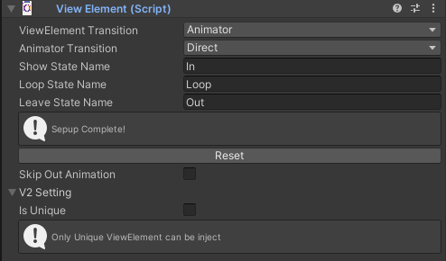
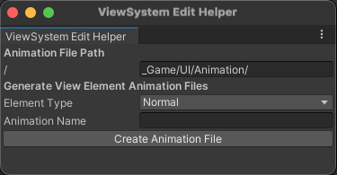
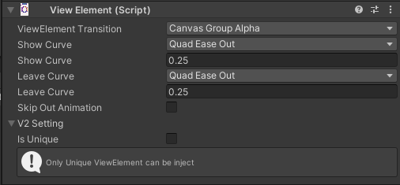
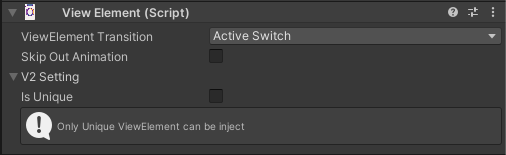
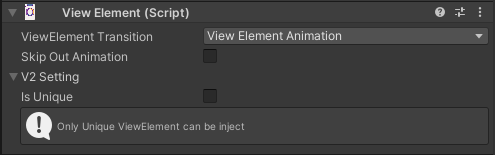
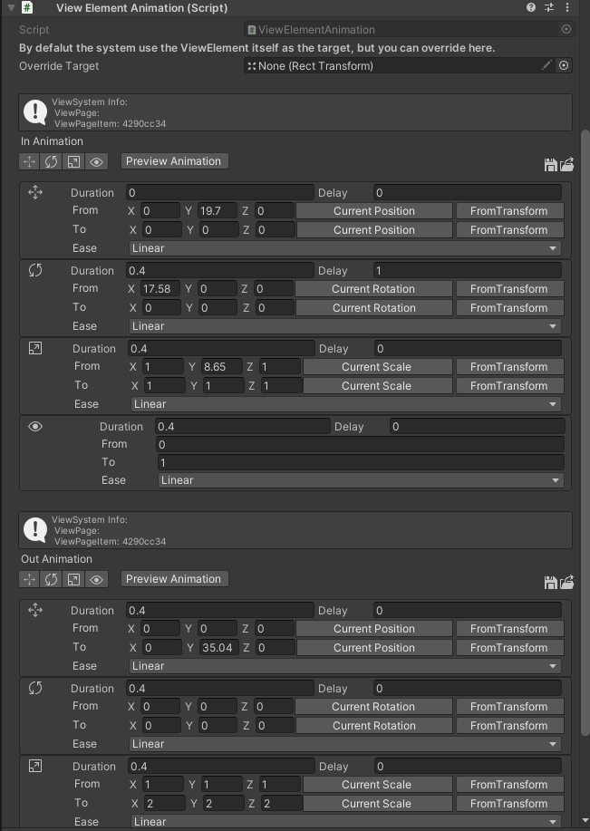
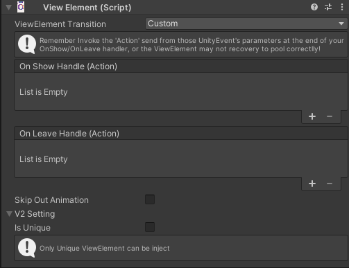

# ViewElement Transition

### Animator 

When showing or leaving, the ViewElement will trigger the nearby Animator to play an animation. The Animator must include animations with the state names: Show State Name, Loop State Name, and Leave State Name.

To quickly create these Animators and Animations, ViewSystem provides an automated generation tool. Go to the toolbar and navigate to
**MacacaGames > ViewSystem > ViewSystem Edit Helper**.

Simply fill in **Aniamtion File Path**, **Element Type**, and  **Animation Name**. Then, click "Create Animation File" to automatically generate the Animator and several animation files in the specified folder. After that, apply the generated content to the Animator component on the ViewElement.

___

### Canvas Group Alpha

When showing or leaving, the ViewElement will adjust the CanvasGroup's alpha with tween.

___

### Active Switch

When showing or leaving, the ViewElement will set GameObject.activeSelf true when shown and false when leaving.

___

### ViewElement Animation

ViewElementAnimation is a simple tool that helps animate a ViewElement. It can control the transform properties (position, rotation, scale) and the CanvasGroup (alpha) using tween animations.
<!-- TODO:把ViewElementAnimation Editor說明更清楚 -->

___

### Custom

When showing or leaving, the ViewElement will trigger the corresponding Unity Event.
