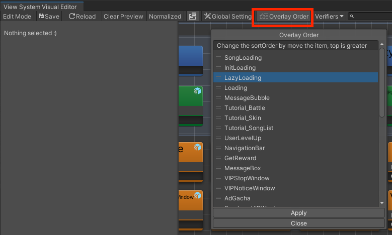
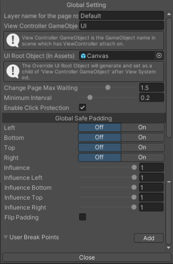

# Visual Editor

## ViewPage Data Storage
Each ViewPage and ViewState will be stored as a ScriptableObject in the ViewSystemResources, containing the necessary information to correctly display the ViewPage.

## Editor Tool Bar
### Edit Mode
Turn on to preview ViewPage in edit time. This will create a temporary scene, allowing users to preview changes in the ViewPage in real-time.

(Turn off or click save button before enter Unity play mode, since Preview ViewPage only work properly under Unity edit mode)
### Save
Save all changes and exit Edit Mode.
### Reload 
Reset View System Visual Editor. Useful when something went wrong in editor.
<!-- TODO:搞清楚Reload還有沒有正常運作，還有如何說明 -->
<!-- ClearEditor dataReader.Init( dataReader.EditEnd(); CanEnterEditMode = true; -->
### Clear Preview
Cancel the preview of the current ViewPage 
### Normalized
- Auto migrate old save data to new version (one big data to separated page data)
- Repair prefab references in ViewPages and ViewStates
- Clear preview scene

### (Show Inspector)  
show/hide Inspector
### Global Setting
Open Global Setting panel. See [Global Setting Panel](#global-setting-panel) for more detail.
### Overlay Order
Use the Page Order tool to adjust the sort order of overlay pages. Simply drag and drop to rearrange the order and click Apply to save the new layer settings.



### Verifiers
- Verify GameObject
verity if any GameObject is missing
- Verify Overrides
verity if any Override is missing
- Verify Events
verity if any Event is missing
- Verify Pages and States
verity if any ViewElement in ViewPage or ViewState is missing
### (Search Bar)
Search name of ViewPage. All matching targets will be highlighted.
### Zoom Slider
Zoom in/out ViewSystem Editor
### (Reset viewport) 
Reset viewport to (0,0)


### (Bake ViewPage and ViewState to script)  
ViewSystem provides the functionality to convert ViewPage and ViewState into C# scripts. This makes it easier and less likely to make mistakes when referencing ViewPage names in the code.

After pressing the button, ViewSystem will generate a C# script in ViewSystemResources folder.

Use `ViewSystemScriptable` to get generated page names:
```csharp
ViewController
    .OverlayPageChanger()
    .SetPage(ViewSystemScriptable.ViewPages.ViewElementInjectOutput)
    .SetPageModel(inputText,inputInt)
    .Show();
```

> Note that the names of ViewPage or ViewState must not violate C# variable naming conventions, as this will result in a compile error for the generated variables.
### Options
- Allow Preview When Playing
- Get Override From Original Prefab
- Remove Connect Without Confirm
- [Migrate to split transform]


## Global Setting Panel



